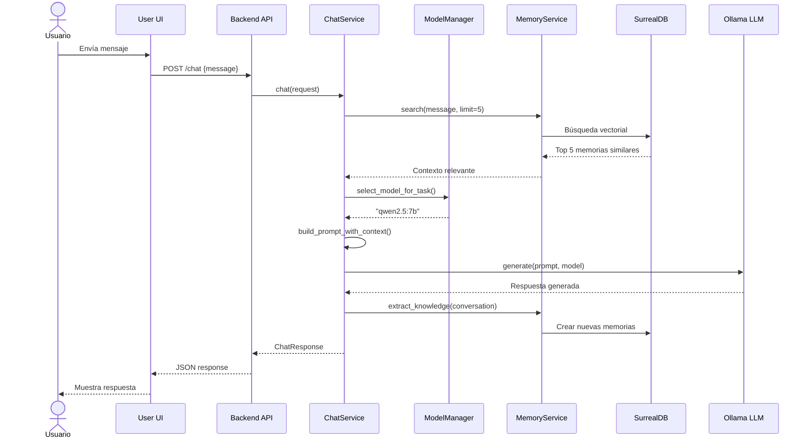
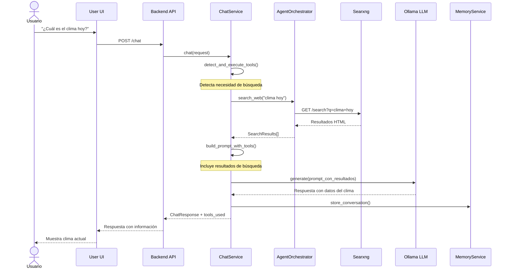
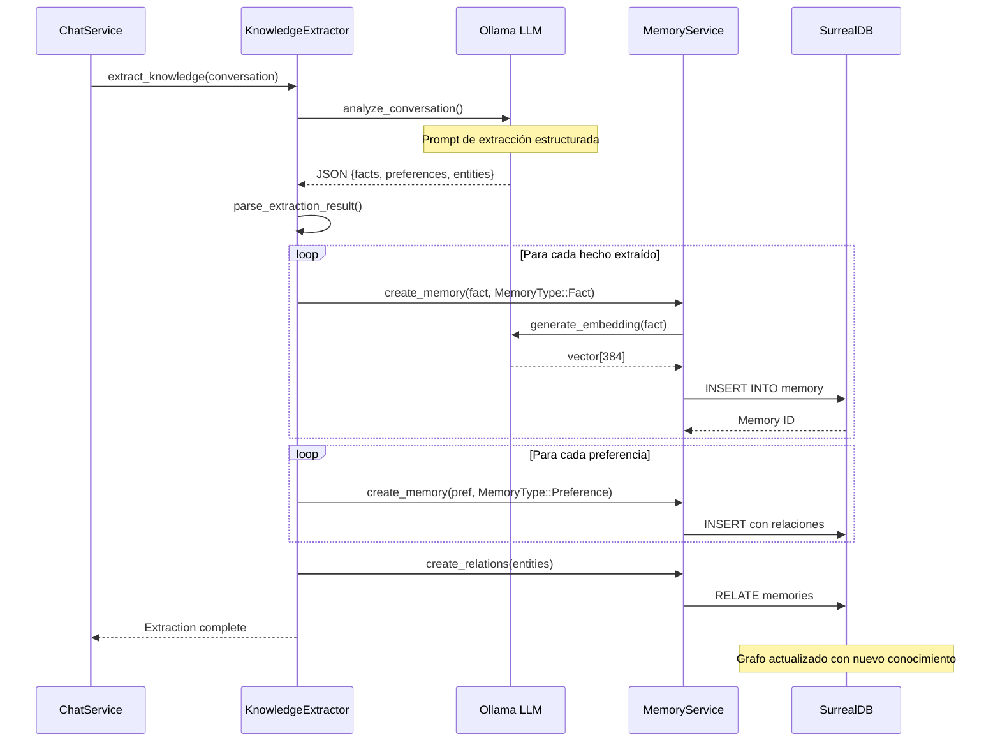
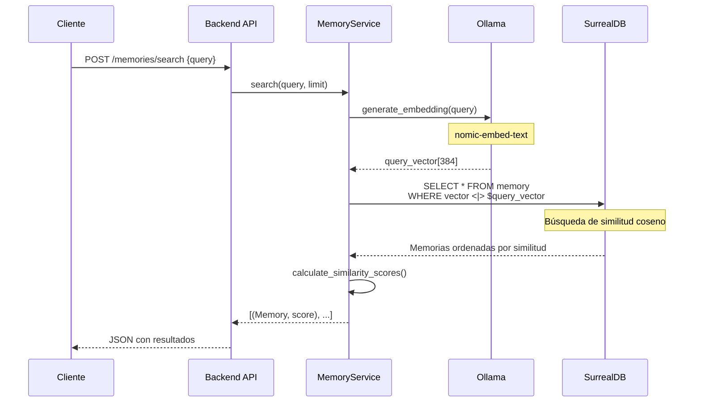
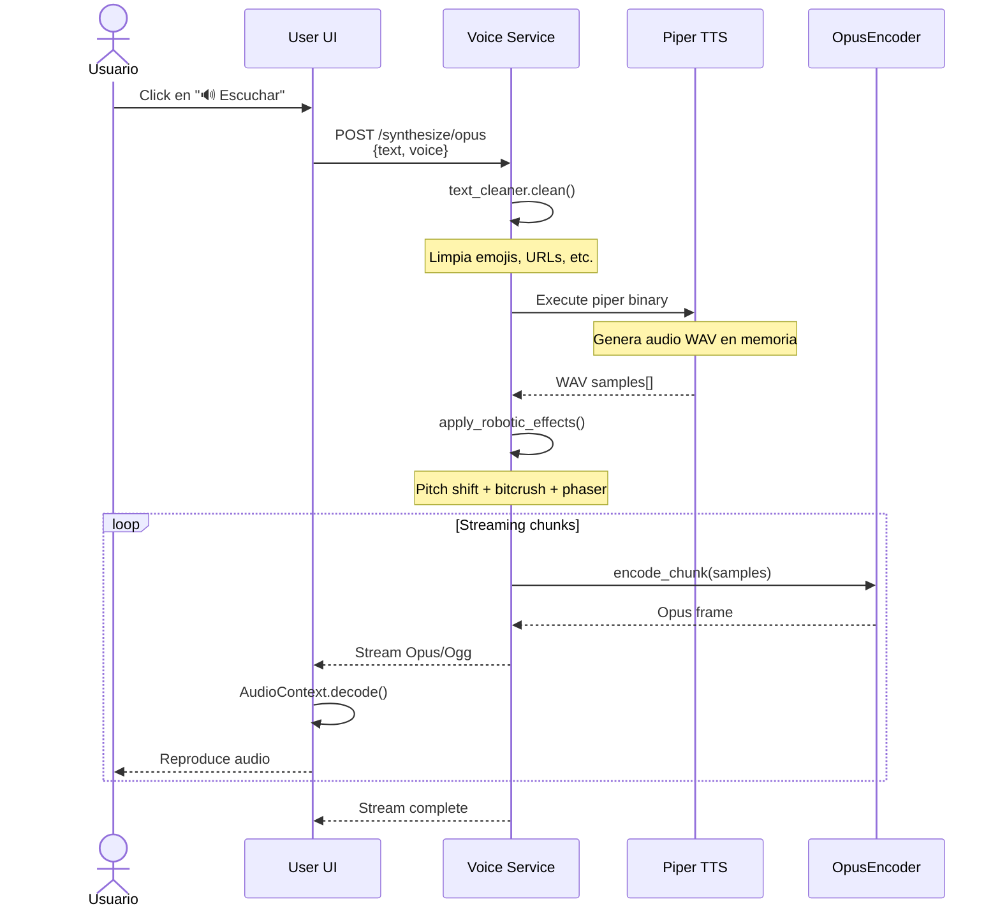
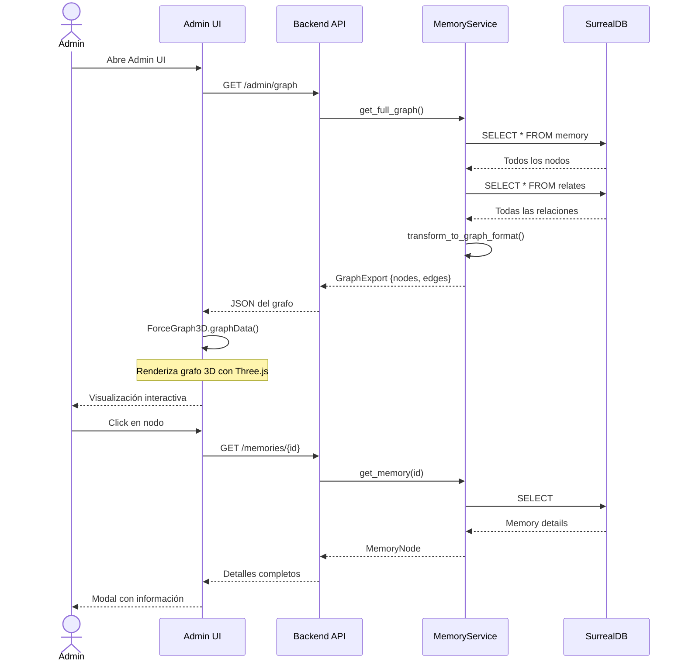

# 🧠 TACHIKOMA-OS - Sistema de IA con Memoria GraphRAG

**TACHIKOMA-OS** es un ecosistema completo de inteligencia artificial que combina memoria a largo plazo basada en grafos (GraphRAG), agentes inteligentes con herramientas, y selección automática de modelos LLM según la complejidad de la tarea.

## 📋 Tabla de Contenidos

- [Descripción General](#-descripción-general)
- [Arquitectura del Sistema](#-arquitectura-del-sistema)
- [Componentes Principales](#-componentes-principales)
- [Flujos de Operación](#-flujos-de-operación)
- [Tecnologías Utilizadas](#-tecnologías-utilizadas)
- [Instalación y Configuración](#-instalación-y-configuración)
- [Uso](#-uso)

---

## 🎯 Descripción General

TACHIKOMA-OS implementa un patrón **GraphRAG (Graph Retrieval-Augmented Generation)** donde cada conversación y dato importante se almacena como un nodo en un grafo de conocimiento con embeddings vectoriales. Esto permite:

- **Memoria Semántica**: Búsqueda por significado, no solo por palabras clave
- **Contexto Relacional**: Conectar información relacionada mediante 11 tipos de relaciones
- **Aprendizaje Automático**: Extracción inteligente de hechos, preferencias y entidades
- **Persistencia**: La IA recuerda conversaciones pasadas y aprende del usuario

### Características Principales

✨ **GraphRAG Memory Engine**
- Base de datos híbrida grafo + vectorial (SurrealDB).
- 11 tipos de relaciones semánticas (RelatedTo, Causes, PartOf, etc.)
- Búsqueda semántica por similitud de embeddings
- Extracción automática de conocimiento de conversaciones

🤖 **Sistema de Agentes Inteligentes**
- Selección automática de modelo según VRAM disponible
- Herramientas integradas: búsqueda web, ejecución de comandos, memoria
- Orquestación inteligente de tareas complejas

🎙️ **Síntesis de Voz**
- Motor TTS ultra-rápido con Piper
- Efectos robóticos en tiempo real
- Streaming de audio en formato Opus

💻 **Interfaces Múltiples**
- UI de usuario (chat conversacional)
- UI de administración (visualización del grafo)
- CLI interactiva (Z-Brain shell)
- API REST completa

---

## 🏗️ Arquitectura del Sistema

```
┌─────────────────────────────────────────────────────────────────────┐
│                          CAPA DE PRESENTACIÓN                       │
├─────────────────────────────────────────────────────────────────────┤
│                                                                      │
│  ┌─────────────┐  ┌─────────────┐  ┌─────────────┐  ┌─────────────┐│
│  │  User UI    │  │  Admin UI   │  │   Z-Brain   │  │ External    ││
│  │  (React +   │  │  (React +   │  │   (Rust     │  │ Clients     ││
│  │  Vite)      │  │  3D Graph)  │  │   CLI)      │  │ (API REST)  ││
│  └──────┬──────┘  └──────┬──────┘  └──────┬──────┘  └──────┬──────┘│
│         │                │                │                │        │
│         └────────────────┴────────────────┴────────────────┘        │
│                                   │                                  │
└───────────────────────────────────┼──────────────────────────────────┘
                                    │
                                    │ HTTP/REST
                                    │
┌───────────────────────────────────┼──────────────────────────────────┐
│                          CAPA DE API (Axum)                          │
├─────────────────────────────────────────────────────────────────────┤
│                                   │                                  │
│  ┌────────────────────────────────┴────────────────────────────────┐│
│  │                         REST Endpoints                          ││
│  │  /chat  /agent  /memories  /graph  /voice  /system            ││
│  └────────────────────────────────┬────────────────────────────────┘│
│                                   │                                  │
└───────────────────────────────────┼──────────────────────────────────┘
                                    │
┌───────────────────────────────────┼──────────────────────────────────┐
│                       CAPA DE APLICACIÓN                             │
├─────────────────────────────────────────────────────────────────────┤
│                                                                      │
│  ┌──────────────────┐  ┌────────────────────┐  ┌─────────────────┐ │
│  │  ChatService     │  │  MemoryService     │  │ ModelManager    │ │
│  │  - Conversación  │  │  - GraphRAG        │  │ - Auto-select   │ │
│  │  - Contexto      │  │  - Búsqueda        │  │ - VRAM check    │ │
│  └────────┬─────────┘  └─────────┬──────────┘  └────────┬────────┘ │
│           │                      │                       │          │
│  ┌────────┴──────────────────────┴───────────────────────┴────────┐ │
│  │              AgentOrchestrator                                 │ │
│  │  ┌───────────────┐ ┌───────────────┐ ┌────────────────────┐  │ │
│  │  │ search_web    │ │ execute_cmd   │ │ remember/recall    │  │ │
│  │  └───────────────┘ └───────────────┘ └────────────────────┘  │ │
│  └────────────────────────────────────────────────────────────────┘ │
│           │                      │                       │          │
│  ┌────────┴──────────────────────┴───────────────────────┴────────┐ │
│  │           KnowledgeExtractor (Aprendizaje Automático)          │ │
│  │  - Extracción de hechos        - Detección de preferencias    │ │
│  │  - Identificación de entidades - Creación de relaciones       │ │
│  └────────────────────────────────────────────────────────────────┘ │
│                                                                      │
└───────────────────────────────────┬──────────────────────────────────┘
                                    │
┌───────────────────────────────────┼──────────────────────────────────┐
│                      CAPA DE DOMINIO                                 │
├─────────────────────────────────────────────────────────────────────┤
│                                                                      │
│  ┌──────────────┐  ┌──────────────┐  ┌──────────────────────────┐  │
│  │MemoryNode    │  │   Relation   │  │  Ports (Interfaces)      │  │
│  │- content     │  │- 11 tipos    │  │- LlmProvider             │  │
│  │- vector      │  │- RelatedTo   │  │- MemoryRepository        │  │
│  │- type        │  │- Causes      │  │- SearchProvider          │  │
│  │- metadata    │  │- PartOf...   │  │- CommandExecutor         │  │
│  └──────────────┘  └──────────────┘  └──────────────────────────┘  │
│                                                                      │
└───────────────────────────────────┬──────────────────────────────────┘
                                    │
┌───────────────────────────────────┼──────────────────────────────────┐
│                   CAPA DE INFRAESTRUCTURA                            │
├─────────────────────────────────────────────────────────────────────┤
│                                                                      │
│  ┌────────────────┐  ┌────────────────┐  ┌──────────────────────┐  │
│  │  SurrealDB     │  │  Ollama        │  │  Searxng             │  │
│  │  - Graph DB    │  │  - LLM Local   │  │  - Web Search        │  │
│  │  - Vector DB   │  │  - GPU/CPU     │  │  - Sin tracking      │  │
│  │  - Port 8000   │  │  - Port 11434  │  │  - Port 8080         │  │
│  └────────────────┘  └────────────────┘  └──────────────────────┘  │
│                                                                      │
│  ┌────────────────┐                                                 │
│  │  Voice Service │                                                 │
│  │  - Piper TTS   │                                                 │
│  │  - Opus Stream │                                                 │
│  │  - Port 8100   │                                                 │
│  └────────────────┘                                                 │
│                                                                      │
└─────────────────────────────────────────────────────────────────────┘
```

---

## 🔧 Componentes Principales

### 1. Backend (Rust + Axum)
**Ubicación**: `tachikoma-backend/`

El núcleo del sistema, implementado siguiendo arquitectura hexagonal (Ports & Adapters):

- **API REST**: Endpoints para chat, memoria, agentes y administración
- **ChatService**: Gestiona conversaciones con contexto de memoria
- **MemoryService**: CRUD de memoria + búsqueda semántica
- **AgentOrchestrator**: Coordina herramientas del agente
- **ModelManager**: Selecciona el modelo óptimo según VRAM
- **KnowledgeExtractor**: Extrae automáticamente conocimiento de conversaciones

**Puertos principales**:
- `3000`: API HTTP

### 2. SurrealDB (Graph + Vector Database)
**Contenedor**: `tachikoma-surrealdb`

Base de datos híbrida que combina:
- **Grafo de relaciones**: Conexiones semánticas entre memorias
- **Búsqueda vectorial**: Embeddings para similitud semántica
- **Schema flexible**: Adaptable a diferentes tipos de memoria

**Características**:
- 11 tipos de relaciones definidas
- Índices vectoriales para búsqueda rápida
- Almacenamiento persistente en `/data`

### 3. Ollama (LLM Local)
**Contenedor**: `tachikoma-ollama`

Servidor de inferencia de modelos de lenguaje:

**Modelos soportados**:
- `ministral-3b`: Rápido, <4GB VRAM
- `qwen2.5:7b`: Balanceado, 4-8GB VRAM
- `qwen2.5-coder:14b`: Complejo/código, >8GB VRAM
- `nomic-embed-text`: Generación de embeddings

**Configuración**:
- Keep-alive: `-1` (mantiene modelos cargados)
- Context length: 4096 tokens
- GPU support: NVIDIA (opcional)

### 4. Voice Service (Rust + Piper TTS)
**Ubicación**: `tachikoma-voice/`

Servicio de síntesis de voz de alta velocidad:

- **Engine**: Piper TTS (ONNX)
- **Efectos**: Robóticos en tiempo real (pitch, bitcrush, phaser)
- **Streaming**: Opus/Ogg para baja latencia
- **Voces**: Español (claude-high)

**Endpoints**:
- `/synthesize`: WAV completo
- `/synthesize/stream`: Streaming WAV
- `/synthesize/opus`: Streaming Opus

### 5. User UI (React + Vite)
**Ubicación**: `tachikoma-ui/`

Interfaz de chat para usuarios finales:

**Características**:
- Chat conversacional con historial
- Markdown + syntax highlighting
- i18n (Español/Inglés)
- Tema claro/oscuro
- Indicadores de escritura

**Puerto**: `5173`

### 6. Admin UI (React + Three.js)
**Ubicación**: `tachikoma-admin/`

Panel de administración del grafo de memoria:

**Características**:
- Visualización 3D del grafo (react-force-graph-3d)
- Estadísticas y métricas
- CRUD de memorias
- Exploración de relaciones
- Dashboard de salud del sistema

**Puerto**: `5174`

### 7. Z-Brain CLI (Rust)
**Ubicación**: `zbrain/`

Shell interactiva para la terminal:

**Comandos especiales**:
- `/help`: Ayuda
- `/new`: Nueva conversación
- `/search <query>`: Buscar en memoria
- `/models`: Listar modelos

**Modos**:
```bash
# Interactivo
zbrain

# Query única
zbrain "¿Cuál es la capital de Francia?"
```

### 8. Searxng (Metabuscador)
**Contenedor**: `tachikoma-searxng`

Motor de búsqueda privado para el agente:

- Sin tracking ni perfiles
- Agrega resultados de múltiples motores
- Configuración customizable en `config/searxng/`

**Puerto**: `8080`

---

## 🔄 Flujos de Operación

### Flujo 1: Chat Simple (Sin herramientas)



### Flujo 2: Chat con Herramientas (Búsqueda Web)



### Flujo 3: Extracción de Conocimiento (Auto-Learning)



### Flujo 4: Búsqueda Semántica en Memoria



### Flujo 5: Síntesis de Voz (TTS Streaming)



### Flujo 6: Visualización del Grafo (Admin UI)



---

## 💾 Estructura de Datos GraphRAG

### MemoryNode (Nodo de Memoria)

```rust
{
  "id": "uuid-v4",
  "content": "El usuario prefiere interfaces en modo oscuro",
  "vector": [0.123, -0.456, 0.789, ...],  // 384 dimensiones
  "memory_type": "Preference",
  "metadata": {
    "tags": ["ui", "preferencias"],
    "source": "conversation",
    "importance": 0.85,
    "confidence": 0.92
  },
  "created_at": "2024-12-23T10:30:00Z",
  "updated_at": "2024-12-23T10:30:00Z",
  "access_count": 15,
  "importance_score": 0.85
}
```

### Tipos de Memoria

```rust
enum MemoryType {
    Fact,           // Hechos verificables
    Preference,     // Preferencias del usuario
    Procedure,      // Procedimientos/instrucciones
    Insight,        // Insights/conclusiones
    Context,        // Contexto situacional
    Conversation,   // Fragmentos de conversación
    Task,           // Tareas pendientes
    Entity,         // Entidades (personas, lugares)
    Goal,           // Objetivos
    Skill,          // Habilidades
    Event,          // Eventos
    Opinion,        // Opiniones
    Experience,     // Experiencias
    General,        // General
}
```

### Tipos de Relaciones

```rust
enum Relation {
    RelatedTo,      // Relación general
    Causes,         // A causa B
    PartOf,         // A es parte de B
    Follows,        // A sigue a B (temporal)
    Contradicts,    // A contradice B
    Supports,       // A apoya B
    DerivedFrom,    // A se deriva de B
    SameAs,         // A es lo mismo que B
    ContextOf,      // A es contexto de B
    HasProperty,    // A tiene propiedad B
    UsedFor,        // A se usa para B
}
```

### Ejemplo de Grafo

```
┌─────────────────┐
│  "Usuario usa   │
│   Rust"         │◄────────────┐
│  [Fact]         │             │
└────────┬────────┘             │
         │                      │
         │ RelatedTo            │ Supports
         │                      │
         ▼                      │
┌─────────────────┐             │
│ "Usuario prefie-│             │
│  re programación│             │
│  funcional"     │◄────────────┘
│  [Preference]   │
└────────┬────────┘
         │
         │ ContextOf
         │
         ▼
┌─────────────────┐
│ "Proyecto en    │
│  Axum framework"│
│  [Context]      │
└─────────────────┘
```

---

## 🛠️ Tecnologías Utilizadas

### Backend
- **Rust** (1.75+): Lenguaje principal
- **Axum** (0.7): Framework web asíncrono
- **Tokio**: Runtime asíncrono
- **SurrealDB**: Base de datos grafo + vectorial
- **Tower**: Middleware y servicios

### Frontend
- **React** (18.3): Biblioteca UI
- **TypeScript**: Type safety
- **Vite**: Build tool y dev server
- **TailwindCSS**: Estilos utility-first
- **react-force-graph-3d**: Visualización de grafos
- **Three.js**: Gráficos 3D

### IA y ML
- **Ollama**: Inferencia de LLMs locales
- **Piper TTS**: Síntesis de voz neural
- **nomic-embed-text**: Embeddings (384d)
- **Qwen2.5**: Modelos de lenguaje

### Infraestructura
- **Docker + Docker Compose**: Orquestación
- **Searxng**: Metabuscador privado
- **NVIDIA Container Toolkit**: GPU support

---

## 📦 Instalación y Configuración

### Requisitos Previos

- **Docker** + Docker Compose
- **Rust** 1.75+ (para desarrollo)
- **Node.js** 18+ (para UIs)
- **NVIDIA GPU** (opcional, para aceleración)

### Instalación Rápida

```bash
# 1. Clonar repositorio
git clone <repository-url> kibo
cd kibo

# 2. Ejecutar script de setup
./setup.sh

# 3. Iniciar todos los servicios
./start.sh

# Servicios estarán disponibles en:
# - Backend API: http://localhost:3000
# - User UI: http://localhost:5173
# - Admin UI: http://localhost:5174
# - SurrealDB: http://localhost:8000
# - Ollama: http://localhost:11434
# - Searxng: http://localhost:8080
# - Voice: http://localhost:8100
```

### Desarrollo

```bash
# Limpiar puertos (si hay conflictos)
./stop.sh

# Iniciar solo servicios Docker
./start.sh --docker

# En terminales separadas:
# Terminal 1: Backend
cd tachikoma-backend
cargo watch -x run

# Terminal 2: User UI
cd tachikoma-ui
npm run dev

# Terminal 3: Admin UI
cd tachikoma-admin
npm run dev

# Terminal 4: CLI
cd zbrain
cargo run
```

### Variables de Entorno

```env
# SurrealDB
SURREAL_USER=root
SURREAL_PASS=tachikomaos_secret_2024

# Backend
DATABASE_URL=ws://127.0.0.1:8000
DATABASE_USER=root
DATABASE_PASS=tachikomaos_secret_2024
OLLAMA_URL=http://127.0.0.1:11434
SEARXNG_URL=http://127.0.0.1:8080
VOICE_SERVICE_URL=http://127.0.0.1:8100
RUST_LOG=info

# Voice Service
PIPER_BIN=/app/piper/piper
MODELS_DIR=/app/models
DEFAULT_VOICE=es_MX-claude-high
```

---

## 🚀 Uso

### User UI (Chat)

1. Abre `http://localhost:5173`
2. Escribe un mensaje en el chat
3. La IA responderá con contexto de memoria
4. Usa comandos especiales:
   - "busca información sobre..." → activa búsqueda web
   - "recuerda que..." → guarda en memoria explícitamente

### Admin UI (Visualización)

1. Abre `http://localhost:5174`
2. Ve el grafo de memoria en 3D
3. Haz click en nodos para ver detalles
4. Filtra por tipo de memoria
5. Ve estadísticas del sistema

### Z-Brain CLI

```bash
# Interactivo
./zbrain/target/release/zbrain

# Comandos
/help                    # Ver ayuda
/new                     # Nueva conversación
/search rust programming # Buscar en memoria
/models                  # Ver modelos disponibles

# Query directa
./zbrain/target/release/zbrain "¿Qué es Rust?"
```

### API REST

```bash
# Chat
curl -X POST http://localhost:3000/chat \
  -H "Content-Type: application/json" \
  -d '{"message": "Hola, ¿cómo estás?"}'

# Buscar en memoria
curl -X POST http://localhost:3000/memories/search \
  -H "Content-Type: application/json" \
  -d '{"query": "programación", "limit": 5}'

# Ver grafo completo
curl http://localhost:3000/admin/graph

# Síntesis de voz
curl -X POST http://localhost:8100/synthesize/opus \
  -H "Content-Type: application/json" \
  -d '{"text": "Hola mundo", "voice": "es_MX-claude-high"}' \
  --output audio.ogg
```

---

## 📊 Métricas y Monitoreo

### Health Checks

```bash
# Backend
curl http://localhost:3000/health

# SurrealDB
curl http://localhost:8000/health

# Ollama
curl http://localhost:11434/api/tags

# Voice Service
curl http://localhost:8100/health
```

### Estadísticas del Grafo

```bash
curl http://localhost:3000/admin/stats
```

Respuesta:
```json
{
  "total_memories": 1523,
  "total_relations": 3847,
  "memories_by_type": {
    "Fact": 456,
    "Preference": 123,
    "Conversation": 789,
    "Entity": 155
  },
  "relations_by_type": {
    "RelatedTo": 1234,
    "Causes": 456,
    "PartOf": 789
  }
}
```

---

## 🔐 Seguridad

- **Comandos seguros**: Lista blanca de comandos permitidos
- **Sin tracking**: Searxng no rastrea búsquedas
- **Local-first**: LLMs ejecutan localmente
- **CORS**: Configurado para dominios permitidos

---

## 📈 Rendimiento

### Benchmarks

- **Búsqueda semántica**: ~50ms (1000 nodos)
- **Generación LLM**: 20-60 tokens/seg (según modelo)
- **Síntesis TTS**: ~0.5x realtime (streaming)
- **API latency**: <100ms (p95)

### Optimizaciones

- Keep-alive de modelos Ollama
- Índices vectoriales en SurrealDB
- Streaming de audio en chunks
- Compilación release con LTO

---

## 🤝 Contribución

Ver `CONTRIBUTING.md` para guías de desarrollo.

---

## 📄 Licencia

MIT License - Ver `LICENSE` para detalles.

---

## 👨‍💻 Autor

**madKoding** - Sistema TACHIKOMA-OS

---

## 🙏 Agradecimientos

- **Ollama**: Inferencia LLM local
- **SurrealDB**: Base de datos híbrida
- **Piper TTS**: Síntesis de voz neural
- **Axum**: Framework web de alto rendimiento
